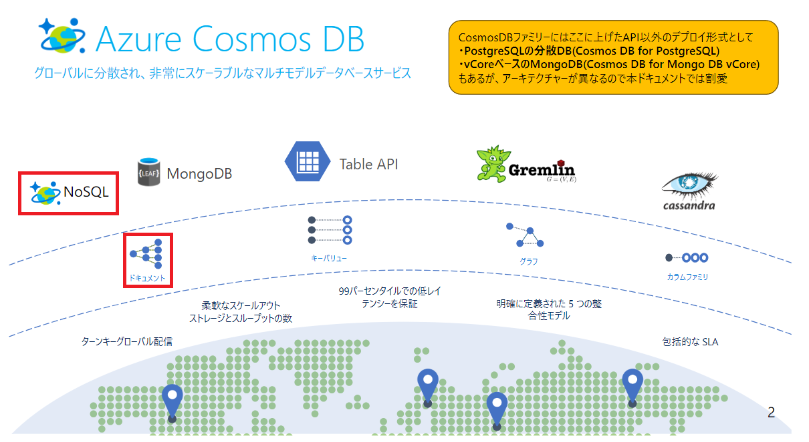
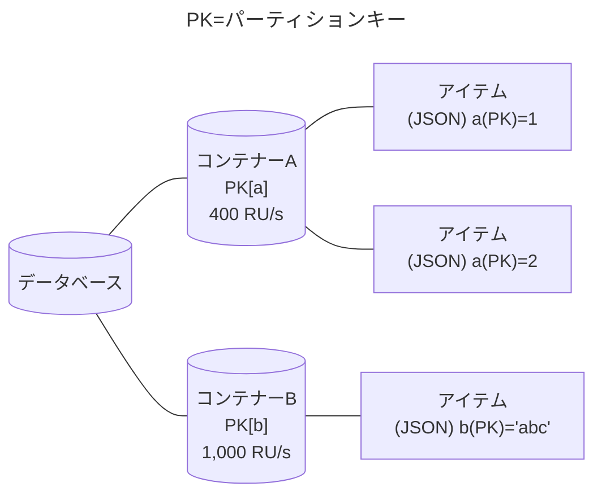
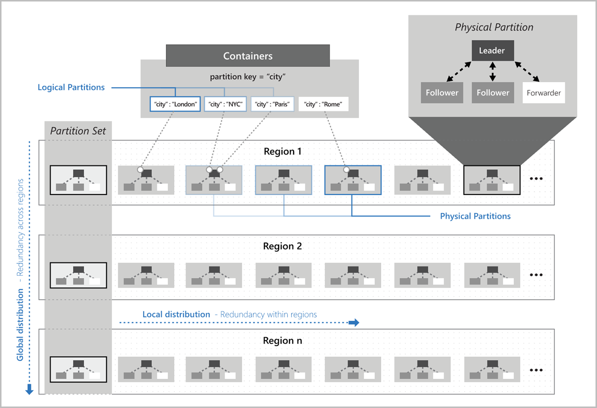
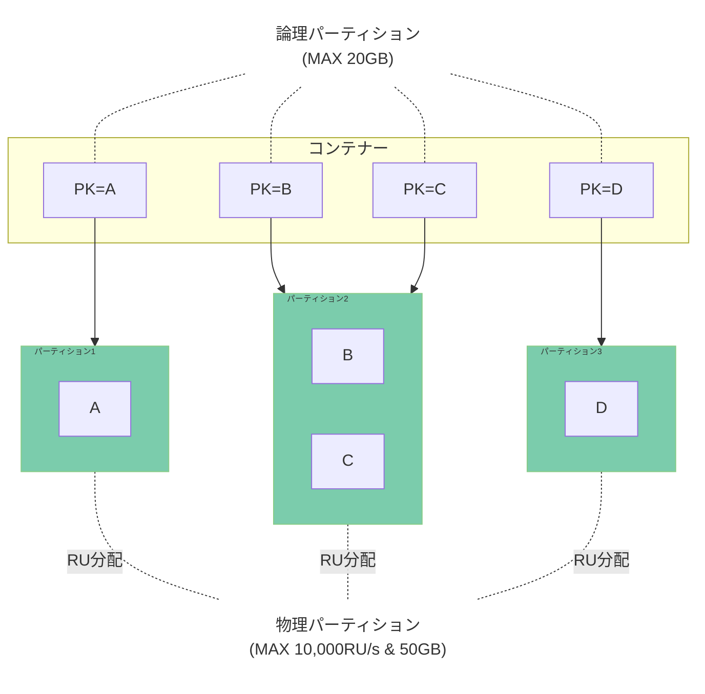
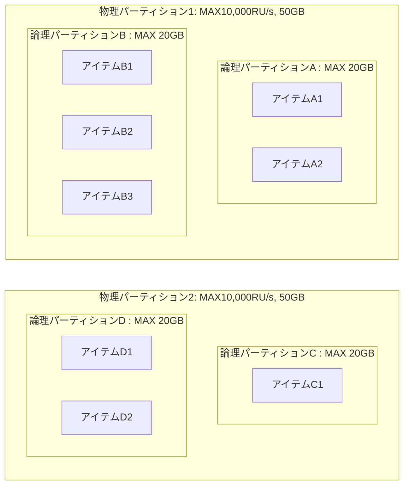
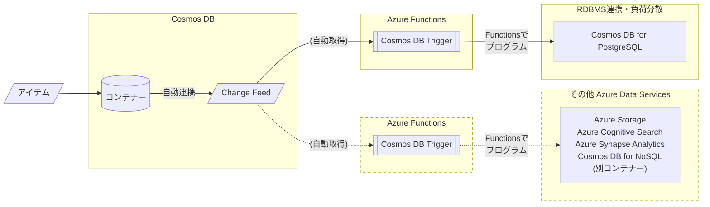
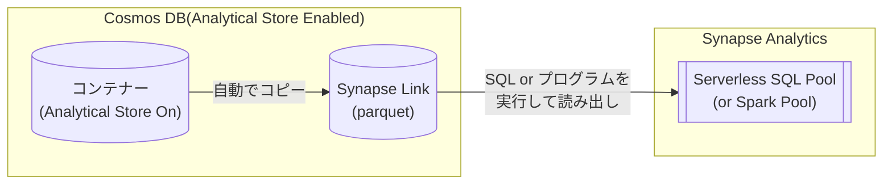
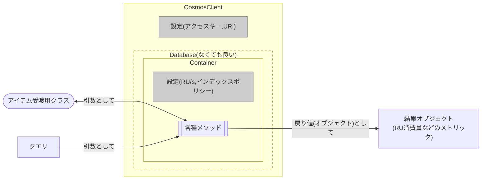

# Cosmos DB for NoSQL 概要

[目次へもどる](./readme.md)

## Cosmos DB for NoSQLとは？



- Cosmos DBはMicrosoft Azureで利用できる**NoSQLデータストア**
    - NoSQLはいわゆる **データベース(RDBMS)** とは異なる概念と理解するのが良い
    - NoSQLはファイルの簡便性とRDBMSの高速検索の良いところを両方持っている
    - NoSQLはRDBMSを補完する概念であり、排他的ではない 

## CosmosDBの優位性

### **ドキュメント(JSON)** を基準とする柔軟なデータ構造
- JSONは以下のような形で**事前の項目定義が必要ない(スキーマレス)柔軟なデータ構造**を扱える。
```JSON
{
  "name"   : "John Smith",
  "sku"    : "20223",
  "price"  : 23.95,
  "shipTo" : { "name" : "Jane Smith",
               "address" : "123 Maple Street",
               "city" : "Pretendville",
               "state" : "NY",
               "zip"   : "12345" },
  "billTo" : { "name" : "John Smith",
               "address" : "123 Maple Street",
               "city" : "Pretendville",
               "state" : "NY",
               "zip"   : "12345" }
}
```

### データのクエリにSQL**ライク**なクエリ言語を利用できる。
- SQL**ライク**な表現を利用できる。
```SQL
SELECT c.name, c.price FROM c
WHERE c.price > 10
```

※検索のみ。登録や更新はSQLではなくプログラムで対応する。

### 分散アーキテクチャーによる高速処理 
- 大量データの中から特定の少量データを**高速に検索**できる
- パーティションによるデータ分散と、インデックスによる検索を組み合わせてデータを高速に検索・抽出できる。
- 多数のアクセスが適切に分散されていればレイテンシーが増えることはない。

### データ登録を起点とする**イベント起動**ができイベント駆動型データ処理を実現
- Change Feedという更新キューを持つ。Azure Functionsとの組み合わせで、「1件受信したら何か処理をして他のサービスへ配信する」ようなイベント駆動型処理を簡単に実現することができる。

### Microsoft Azureの優先データサービスとして全世界のデータセンターに展開
-  地理分散を利用して**アクセス元の地域に寄らない高速なアクセス速度**を保証
- **マルチマスター**による高速な書き込み

### 性能に関する高い柔軟性
- **負荷に合わせて性能を自由に変更**できる。自動調整も可能。(注:制約はある)

### 保証された可用性・レイテンシー
- SLAで**99.999%の可用性**を保証 [^1]
- 1KB Read/Writeに関しては**99%の処理を10ms以内で応答**

[^1]: 複数リージョン読み込み・書き込み時のSLA。単一リージョンの場合は99.99%

## Cosmos DBがトレードオフしたこと

### Cosmos DBは結合処理が苦手
- **異なる**コンテナーをまたいでデータを結合することはできない(物理パーティションをまたぐため)
- スキーマレスの特長を生かして、異なる形のデータを同じコンテナーに入れて結合することはできるが **高コスト**  

### Cosmos DBは一貫性を維持するためのトランザクションが苦手
- トランザクション処理はできるが、状況が限定的であり向いていない
  - 後述のストアドプロシージャを用いて、「同一コンテナーの同一パーティションキーをもつ複数ドキュメントの操作に限り」トランザクションが組める

### Cosmos DBは1度の操作で扱うデータ量が多い処理が苦手
- 結合、集計などの処理は大量のデータ読み込みが発生する。  
  Cosmos DBは操作対象となるデータ量に応じて課金が発生するため、高コストになりがち
- 集計・分析用途のためにはCosmos DB以外の別のサービスを組み合わせて利用することが推奨される
  - Cosmos DBで受け取ったデータをSynapse Linkを経由してSpark/SQL/PowerBI等に連携する
  - Change Feedによるデータの都度転送、都度集計
   
## Cosmos DBはどんなシステムに向いているか？

   - 利用者や同時アクセス数は**多い**方が良い
   - 利用される地域は**多い**ほど良い
   - 蓄積されるデータは**多い**方が良い
   - クエリは**シンプル**なほうが良い
   - 処理1回にて抽出されるデータサイズは**少ない**方が良い
   - データが **"HOT"な期間、蓄積して利用する** のが良い
     - 長期的なデータ保存やデータ分析はBlob Storage、Spark、RDBMSなど別の仕組みに任せるほうがよい
     - 別の仕組みにデータを移すための便利な仕組み(ChangeFeed/Synapse Link)が組み込まれている

## 上記を考慮した典型的なユースケース
   - Webアプリ・モバイルアプリのデータ管理
     - 個人のデータ閲覧範囲は狭く、1度の処理で扱うデータは小さいが、ユーザーが多くなれば接続数・総データ量も多くなる
   - IoTデバイスデータ処理
     - デバイス個々のデータ量は少ないが、デバイス数や拠点が多くなるケースが多い
   - プロダクトカタログ
     - 製品種別ごとに管理する情報項目が異なる。そのためスキーマレスと相性がいい
   - ログデータ管理
     - 同時に多くのサービスから異なる形のデータを受け取ることがある 
   - エンタープライズデータ中継
     - 多接続で書き込み負荷の高い処理を引き受ける = **RDBMSへのETL処理の手前に置く**使い方があり
     - 受け取ったデータを複数のサービスに分配したり、時間差で抽出したりする場合に向いている

## 以下のサービスでもCosmos DBが利用されている
  - [Microsoft Teams](https://www.microsoft.com/ja-jp/microsoft-teams/group-chat-software)
  - [Open AI - ChatGPT](https://chat.openai.com/)
  - [弁護士ドットコム - AI法律相談](https://chat.bengo4.com/)

## 開発者向けのメリット
   - アプリケーションの応答速度がアクセス数やデータ量に寄らず一定になる
     - 分散処理に適したアプリ・データモデル設計を行えば、データが増大しても正しく並列処理ができる
     - ビジネスの拡大に伴うアクセス数・データ数の増加を気にせず運用できる
   - アジャイル方式のシステム開発・変更の効率化に寄与
      - スキーマレスの恩恵
          - データベース項目の変更があっても過去データを直さなくてよい
          - アジャイル開発の中でデータモデルが変化することを許容できる

# Cosmos DBの仕組み

## スループット(Request Unit:RU) とは

スループットは**コンテナーに対するアイテムの読み書き性能**を規定する。

単位は **RU(Request Unit)** で、1RU = **1KBの読み込みにかかる処理で消費されるリソース**を表す。

Cosmos DB for NoSQLの処理性能は、すべてこのRUで計算される。これは、以下の内部処理を含む。
- 書き込みのためのロック
- インデックスの書き込み、読み出し、検索
- データ検索でフィルター条件にヒットしなかった読み込み

読み込み 1KB=1RUを基準とした場合の各操作の消費RUの目安を下表に示す。

|操作|消費RU(目安)|
|---|---:|
|変更|2~3|
|書き込み|5~6|
|クエリー|5~10+|

これは変更や書き込みではインデックス読み出しや、変更前のデータチェックなどの**内部処理にコストがかかる**ためである。  
また、クエリーでインデックスを利用できなかった場合、WHERE句でフィルタされたデータが少なかったとしてもそれまでにスキャンしたデータが多いとRUの消費は大きくなる。

### スループットの種類

Cosmos DB for NoSQLでは、次の２つの設定を用いて性能を定義する。

#### プロビジョニングスループット
- あらかじめスループットを100RU/s単位で定義しておき、その性能を確保(プロビジョニング)する。
課金単位は100RU/sで、確保された性能以上のリクエストはリクエスト超過(**429**)エラーとして弾かれる。
- スループットの確保の仕方には「標準」と「自動(オートスケール)」の２つがある
    - 標準スループット
        - 常に同じRU/sを確保する。
    - 自動(オートスケール)スループット
        - 最大で利用可能なRU/sを確保し、アイドル時は最小1/10までRU/sを下げる。

#### サーバーレス
- 使用時のみスループットを確保する。
    - 事前のスループット見積もりが困難な場合に適している  
- ただし、以下の制限がある
  - スループットの最大は**20,000RU/s**
  - ストレージの最大量は**1TB**まで
- (後述する)物理パーティションが増えることにより、各物理パーティションに割り当てられるRU/sが下がる。
  - データ容量が**50GBを超えると物理パーティション数が増え**、  
    20,000RU/sをパーティション数で**均等に配布**する(最大パーティションあたり5,000RU/s)
  - RU/sの割り当てが少なくなると、急激なデータの増加、処理の集中などによりパフォーマンスが低下することがある
  
## データベース・コンテナー・アイテム



### アイテム
格納の基本単位。JSONドキュメントが格納される。

JSONドキュメントの項目は自由に定義できるが、コンテナーに定義されている**パーティションキーの値を含める**必要がある。

Cosmos DB for NoSQLでは、**アイテムあたり2MBまで**のサイズ制限がある。

各JSONドキュメントにはユーザーが格納した項目以外にシステム管理上のプロパティがいくつか自動的に設定される。

|システムプロパティ名|目的|
|---|---|
|_rid|項目の一意識別子|
|_etag|オプティミスティック同時実行制御に使用されるエンティティタグ|
|_ts|項目の最終更新のタイムスタンプ(UNIX時間)|
|_self|項目のアドレス指定可能なURI|

### パーティションキー

アイテムの格納場所を決める項目。  
コンテナー作成時に指定が必須であり、コンテナー作成後に変更することはできない。

Cosmos DBのスケールアウトを活用するためには以下の条件を満たす項目をパーティションキーとして設定することが望ましい。

1. 適度に値がばらつくこと。
   - データ格納時の分散の基準となるので、バラつかないと分散できない 
   - 少なくとも(総データ量 ÷ 5~10GB)以上のユニーク数を持つことが望ましい。
2. パーティションキーに設定される値は、アクセスしてくるシステムから常に利用される可能性があること
   - タイムスタンプなど、いずれアクセス頻度が下がる項目ではないこと

パーティションキーの項目は、階層(Hieralchy)を持つことができる。
階層は3つまで指定可能。上位の階層のみの検索についても対象パーティションが特定されることで効率化される。  

例) [Tenant Id] - [User Id] - [Session ID]の3階層で階層型パーティションキーを取る場合:

|Where句に含まれる項目|動作|
|-----|-----|
|[Tenant Id][User Id][Session Id]|完全なパーティション特定|
|[Tenant Id][User Id]|部分的なパーティション特定|
|[Tenant Id]|部分的なパーティション特定|
|[User Id][Session Id]|パーティション特定無効|
|[Session Id]|パーティション特定無効|


### コンテナー

アイテムが格納される場所。  
スキーマを持たないため、異なる項目を持つアイテムを同時に格納できる。

コンテナーごとにスループットを設定する。  

コンテナーの作成時に、パーティションキーを設定する。アイテムはこのパーティションキーに基づいて、論理パーティションに分散格納される。  

コンテナに対してTime to Live(TTL)を設定すると、アイテムは指定した秒数後に自動的に削除される。  
※コンテナにTTLを設定した後、アイテム項目の"ttl"で個別のアイテムのTTLをオーバーライドすることができる。

コンテナーにはストアドプロシージャ、トリガー、ユーザー定義関数を定義することができる。

### データベース

コンテナーのグループ。  
共有スループットの利用時にはデータベースごとに25コンテナーまでスループットの共有が可能。

## パーティション

<!--

-->



<!---

-->

コンテナーごとにアイテムを格納する単位。
**分散アクセスの方法を決定する**キーとなる概念のため、設計上注意が必要。

### 論理パーティション

コンテナーに格納されるアイテムは、パーティションキーのハッシュ値範囲をもとに**論理パーティション**という区画に配置される。  
論理パーティションは同一のパーティションキーを持つアイテムとインデックスを20GBまで格納できる。  
**一つの論理パーティションのサイズが20GB以上になることはできない。** [^2]

[^2]: サービスリクエスト(SR)で一時的に増加を許容することができるが、SLA対象ではなくなる。

### 物理パーティション

論理パーティションは単一の**物理パーティション**に配置される。
物理パーティションは、**最大10,000RU/sの処理能力と最大50GBのストレージをもつ分散処理の単位**である。
この**物理パーティションの処理能力(付与されたRU/s)を基準として**データ操作が行われる。

設定されたスループットや格納されたデータサイズが物理パーティションの上限を超えることにより  
物理パーティションの数は**自動的に増加するが、自動的に減少することはない** [^3]。

> 既存のコンテナーのスループットを増加させる場合、10,000RU/sごとに物理パーティション数が増える。
> 新規のコンテナーに6,000RU/s以上のスループットを設定すると、`設定したRU/s ÷ 6,000`個の物理パーティションが作成される。

設定されたスループットは存在する物理パーティション間で**均等に分配**される [^4]。

例 : 5,000RU/sで利用しているコンテナーを、12,000RU/sに変更した場合、2つの物理パーティションに分散される。各物理パーティションは均等に6,000RU/sのスループットが割り当てられる。  
その後コンテナーのスループットを5,000RU/sに戻した場合でも、2つの物理パーティションに分散されたままとなる。その場合、物理パーティションごとに均等、つまり2,500RU/sのスループットが割り当てられる。

物理パーティションを利用者が制御することは基本的にできない[^3]ため、アプリ/データモデル設計においては**論理パーティション(=パーティションキー設定)とアクセス方式(=クエリのWHERE句)に重点を置くべき**である。
  
具体的には **「同時に多数発生するクエリのWHERE句に相当する項目をパーティションキーの優先的な候補とする」** ことが望ましい。  
これは、WHERE句に指定された項目とパーティションキーが同一であれば、**単一の物理パーティションのみの検索で低コストに結果を返す**ことができるからである。  
逆に、**パーティションキー以外の項目で検索がされた場合**は、少なくとも **すべての物理パーティションを確認**しないと結果が返せないため、必然的にコストは高くなる。

[^3]: 物理パーティションをマージする機能がプレビュー中。  
[^4]: 特定の物理パーティションへのRU割り当てを増加させることができる機能が現在プレビュー中。

## インデックス、インデックスポリシー

インデックスは**アイテムの位置を示す索引**である。  

**インデックスがある項目に対する検索は高速に行うことができる。**  
逆にいえばインデックスがない項目に対する検索はデータを全件スキャンする必要があり、Cosmos DBの仕様からすると非常に非効率な動作となる。

コンテナーに登録されるアイテムには**既定ですべての項目に対してインデックスが生成**される。  
インデックスはCosmos DBのストレージを使用する。また、書き込み・読み出しについてはRUを消費する。   

インデックスは、コンテナーにJSON書式で規定された **インデックス作成ポリシー** にしたがって生成される。  
よって、必要に応じてインデックス作成ポリシーを上書きして、Cosmos DBにおけるインデックス生成を制御することができる。

インデックス作成ポリシーによる代表的な制御を以下に示す。

- インデックス作成モードを制御する
- インデックスを生成する・しない項目を特定する
- 空間インデックス・複合インデックスを作成する

インデックス作成ポリシーはポータルやSDKを用いていつでも変更可能であるが、実際のインデックスの変更はバックエンドでRUを消費しながら実行される。  
進行状況についてはポータル、もしくはSDKで追跡ができる。


## Change Feed


Cosmos DBのコンテナーに登録・変更されたアイテムの情報の順序だてた記録をChange Feedと呼ぶ。

Change Feedにアクセスする方法として以下2つがある。

|アクセス方式|説明|
|----|----|
|プッシュモデル|Azure FunctionsのCosmos DB Triggerを使用してプログラムを起動する|
|プルモデル|プログラムから定期的にChange Feedにアクセスしてデータを取得する|

主として、Azure FunctionsのCosmos DB Triggerを使用してプログラムを起動するプッシュモデルの利便性が高い。  
本ハンズオンではこの方法を使用する。

Change Feed(LatestVersionモード)では削除の情報を取ることができない。  
また、変更に関しても途中の経過を取ることができない。[^5]  

[^5]: 現在、削除の情報を取ることができる、"すべてのバージョンと削除 モード"がプレビュー中である。

## Synapse Link


Cosmos DBのコンテナーに登録されている情報を直接集計や分析にかけるのはCosmos DBの仕様上、好ましくない。  
そのため、集計や分析に掛けるためにデータを集計・分析に適した形で別に保管し、分析・集計に強いSynapse Analyticsからアクセスできるようにする機能がSynapse Linkである。

Cosmos DBのアカウントでAnalytical Storeを有効にすると、コンテナーに登録された情報を自動的にSynapse Linkにコピーする。  
Synapse Linkにコピーされたデータはparquet形式で保管される。parquet形式は列ストア型のデータであり、集計や分析に適した形式である。

Synapse Linkのparquet形式のデータは、Synapse AnalyticsのServerless SQL PoolやSpark Poolから直接参照することができる。  
このアクセスの際、Cosmos DBのRUを消費しない。(Synapse Analyticsの利用料金はかかる)

## SDK

### 各言語での対応

Cosmos DBは以下の言語のSDKを提供している。

- .NET(C#)
- Java
- Node.js
- Python
- Go

> C#,JavaのSDKは最新の機能が反映されやすい。

### Cosmos DB SDKでの開発



1. Client(CosmosClient)の生成
1. Databaseオブジェクトの生成
1. Containerオブジェクトの生成
1. アイテム受信用のクラスの作成(C#)
1. アイテム操作
    1. アイテム作成・更新・削除
        1. idやパーティションキーを指定して該当メソッドを呼び出す
    2. アイテムの取得
        1. idやパーティションキーを指定して該当メソッドを呼び出す
        1. SQL(ライク)なクエリを指定して該当メソッドを呼び出す
2. メトリックなどの取得
    1. 操作メソッドの結果オブジェクトに含まれるエラーコードやRU消費量などを取得する

## 整合性レベル

Cosmos DBは非同期メソッドによる書き込みを行うが、書き込まれたデータが以降の読み込みでどう見えるかを整合性レベルで調整することができる。

強固な整合性から弱い整合性に向かうことにより、可用性が高くなり、待ち時間が短くなり、スループットが向上するが、データの読み取りの整合性は落ちる。

Cosmos DBの整合性レベルは以下５段階となる。

#### 強固 "Strong" 

どのリージョン、どのセッションの読み取りでもコミットされたトランザクションの結果のみが返る。途中の情報や未確定の情報が返ることはない。  
Strongを選んだ場合、以下の制約が掛かる。
 - マルチマスター書き込みは設定できない。単一書き込みリージョン＋複数読み込みリージョンのみ設定可能
 - すべてのリージョンへの書き込みが完了するまで処理は完了しない。よって展開するリージョン数によってはレイテンシーが極めて遅くなる。  
 - 複数のレプリカに書き込む処理が必要となり、書き込み時の要求RUが増加する


#### 有界整合性制約 "Bounded Staleless"

同一リージョンに関しては"Strong"と同等、他のリージョンに関しては「設定されたK(バージョン)、もしくはT(時間)のどちらか短い方までのディレイを許容する」。


#### セッション "Session" (デフォルト)

セッショントークンを同じにする同一セッションでは読み取りは同じとなる。


別セッションでは順序の保証がされるが、ラグが発生する可能性がある。

#### 一貫性のあるプレフィクス "Consistency Prefix"

書き込まれたのちのすべての読み込みについて、順序は保証されるがラグの幅はまちまちとなる。


#### 最終的 "Eventual"

書き込まれたのちの読み込みは順序もラグも保証されない


## CosmosDB for NoSQLをうまく活用するためのDo/Don't

### DO
- クライアントと読み書きのリージョンを近接させる
- 適切なパーティションキーの設定
- 処理単位での秒間同時接続数、最大操作データ量の情報を得る or 想定して、できるだけ正しいスループットを見積もる
- アプリ中心のデータモデルの設計によるドキュメント・コンテナーの簡素化（正規化をしない、無駄にコンテナーを分けない）
- 書込み時に将来必要なことを事前に実施する"Write Heavy"に持っていく
- Change Feedによるイベント駆動処理の活用
- インデックス作成を必要な範囲に限定
- 適切なHTTP429(TooManyRequest)チェックとリトライ設定(2~3%程度のHTTP429はむしろヘルシー)
- 10,000RU/s or ストレージ50GBを境界とする物理パーティションの増加を意識した拡張戦略
- 分析・集計処理へのSynapse Link・分析ストアの活用
- 大量ドキュメントの操作に非同期呼び出しやバルク操作を利用
- 可能であればマルチマスター書き込みを利用
- バースト容量の使用

### DON'T
- 雑なパーティションキーの設定、特に偏りのあるパーティションキーの設定
- 読まないデータをいつまでも置いておく
- インデックスポリシーをデフォルト(全項目にインデックス作成)のままにする
- 無意味に巨大なドキュメントの登録(上限2MBのドキュメントは読むだけで2,000RU以上を常に消費して減らせない)
- HTTP429(TooManyRequest)の発生割合に関するモニタリング、アラートルールなし
- スループットを10,000RU/s単位でむやみに増減させる
- 500GB以上のデータを扱う可能性が分かっている状況でサーバーレスを選択する
- 分析や集計処理をトランザクションストア(RU/sの設定されたコンテナー)で直接実行する
- 大量ドキュメントの操作を同期処理する
- 必要のない整合性"Strong"の使用

<!--
### バックアップ
-->
