# Cosmos DB for NoSQLの操作

[目次へ戻る](./readme.md)

## Cosmos DBアカウントの作成
   
- Azure PortalよりCosmos DBを検索

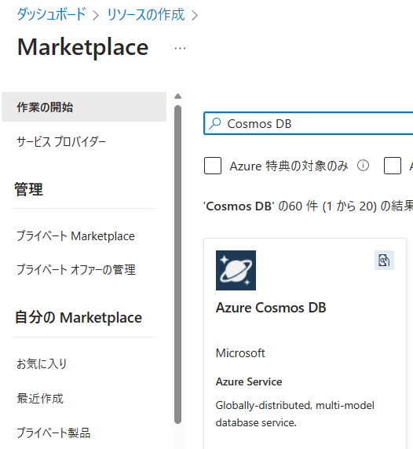

- コア(SQL)を選択

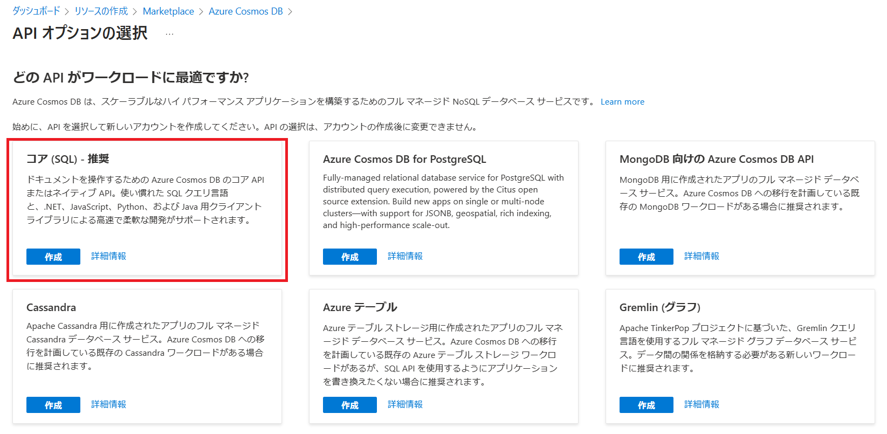

- リソースグループを選択(もしくは新規作成)し、アカウント名、リージョンを決定。容量モードはプロビジョニングスループットを設定。その他はデフォルト値で「レビュー＋作成」を押下

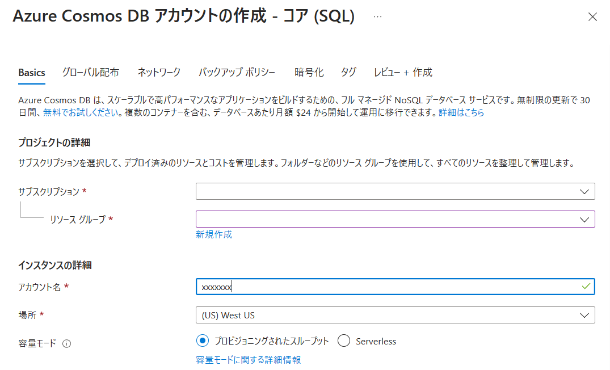
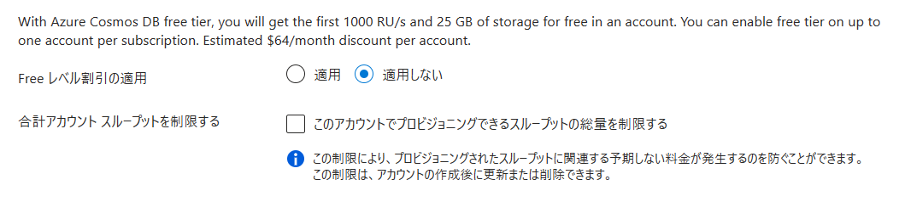

- 内容をレビューし、「作成」を押下

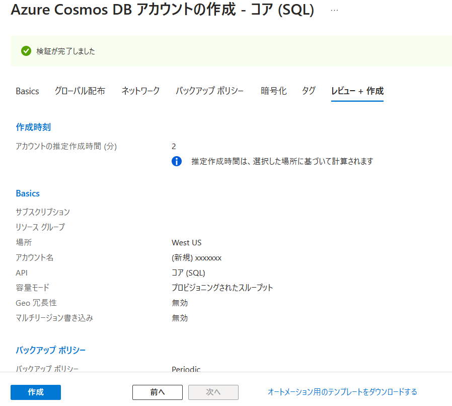

## データベース・コンテナーの作成

### データベースの作成

- ポータルからCosmos DBアカウントを選択し、「データエクスプローラー」を開く  
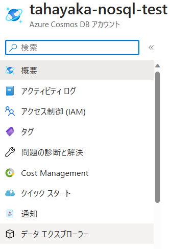

- データエクスプローラーより"New Container"の横の"v"をクリックし、"New Database"を押下  
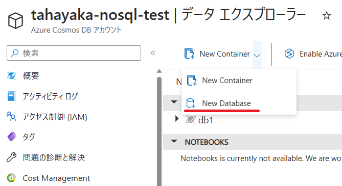

- 右側に現れた入力欄に以下の情報を入力  
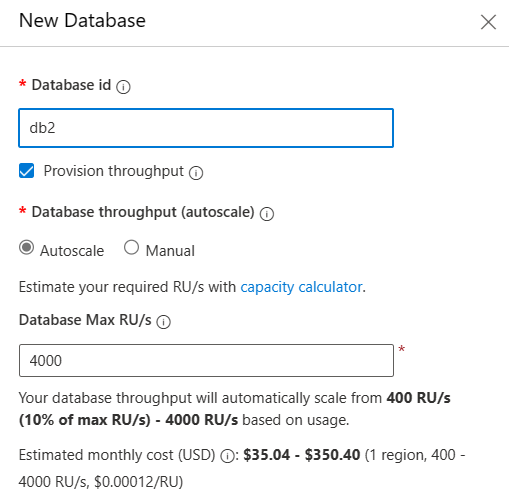

|項目名|意味|サンプル入力|
|---|---|---|
|Database Id|データベース名(必須)| db1 |
|Provision Throughput|プロビジョンスループットにするか| ☑ |
|Database Throughput (autoscale)|標準スループットかオートスケールか| Autoscale |
|Database MaxRU/s|最大RU/s|1,000|

### コンテナーの作成

- データエクスプローラーより"New Container"をクリック  
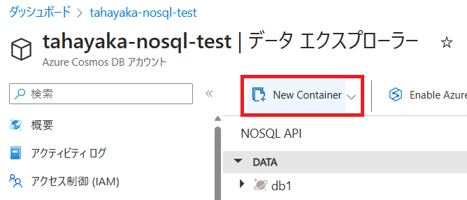

- 右側に現れた入力欄に以下の情報を入力
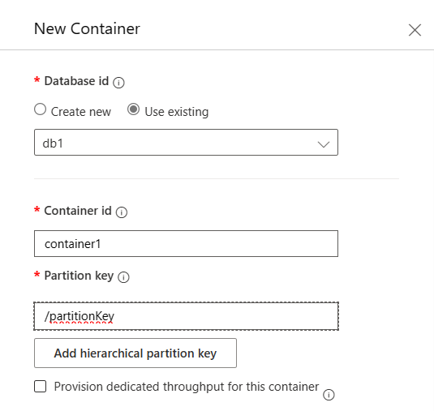

|項目名|意味|サンプル入力|
|---|---|---|
|Database Id|データベース名(必須)| Existingを選択し、db1 |
|Container Id|コンテナー名(必須)|container1|
|Partition Key|パーティションキー| /id |

その他はデフォルトでOK


## アイテムの作成・更新・削除

-データエクスプローラーでコンテナーを選んで、"New Item"を押下

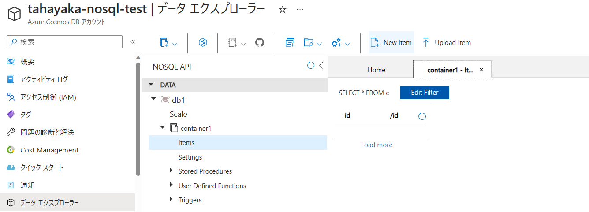

-出てきたウインドウにJSONフォーマットでデータを入力し、SAVE。(以下をコピー&ペーストし、任意に改変)
```JSON
{
   "id"     : "000001",
   "name"   : "John Smith",
   "sku"    : "20223",
   "price"  : 23.95,
   "shipTo" : {
      "name" : "Jane Smith",
      "address" : "123 Maple Street",
      "city" : "Pretendville",
      "state" : "NY",
      "zip"   : "12345"
   },
   "billTo" : {
      "name" : "John Smith",
      "address" : "123 Maple Street",
      "city" : "Pretendville",
      "state" : "NY",
      "zip"   : "12345"
   }
}
```

Save後、システムプロパティが付きリストに登録されることを確認する。

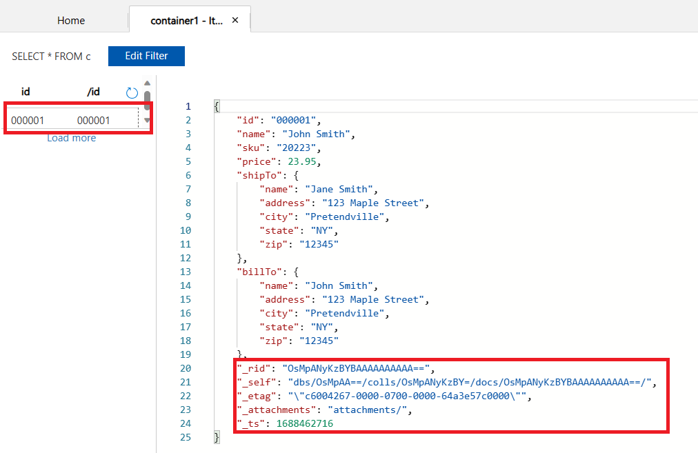

**"id"の値と他の項目の値を変更しつつ**同様の操作を何回か繰り返し、5~10程度のドキュメントを保存する。

## クエリの発行

### サンプルデータの作成

下記2つのJSONアイテムを、前項の操作に従って作成する。

- サンプルデータその1

``` JSON 
{
  "id": "863e778d-21c9-4e2a-a984-d31f947c665c",
  "categoryName": "Surfboards",
  "name": "Teapo Surfboard (6'10\") Grape",
  "sku": "teapo-surfboard-72109",
  "price": 690.00,
  "manufacturer": {
    "name": "Taepo",
    "location": {
      "type": "Point",
      "coordinates": [ 
        34.15562788533047, -118.4633004882891
      ]
    }
  },
  "tags": [
    { "name": "Tail Shape: Swallow" },
    { "name": "Color Group: Purple" }
  ]
}
```

- サンプルデータその2

``` JSON 
{
  "id": "6e9f51c1-6b45-440f-af5a-2abc96cd083d",
  "categoryName": "Sleeping Bags",
  "name": "Vareno Sleeping Bag (6') Turmeric",
  "price": 120.00,
  "closeout": true,
  "manufacturer": {
    "name": "Vareno"
  },
  "tags": [
    { "name": "Color Group: Yellow" },
    { "name": "Bag Shape: Mummy" }
  ]
}
```


### クエリ操作

データエクスプローラー上のツールバーにある、"New SQL Query"を押下。

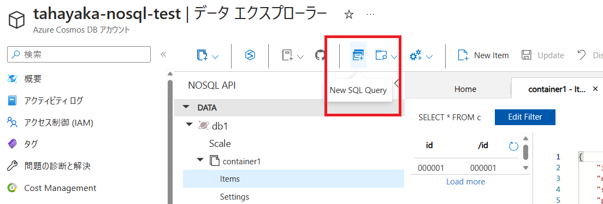

右側ペインにコードを張り付けて"Execute Query"を押下

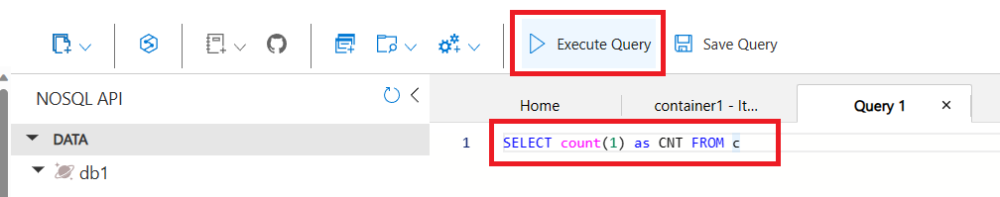

クエリ
```SQL
select count(1) AS CNT from c
```

結果
```JSON
[
    {
        "CNT": 2
    }
]
```
※結果の件数はコンテナーのデータ件数によっては異なる。

### クエリパターン

#### 全件取得

クエリ
```SQL
SELECT * FROM c
```
結果
```JSON
[
    {
        "id": "863e778d-21c9-4e2a-a984-d31f947c665c",
        "categoryName": "Surfboards",
        "name": "Teapo Surfboard (6'10\") Grape",
        "sku": "teapo-surfboard-72109",
        "price": 690,
        "manufacturer": {
            "name": "Taepo",
            "location": {
                "type": "Point",
                "coordinates": [
                    34.15562788533047,
                    -118.4633004882891
                ]
            }
        },
        "tags": [
            {
                "name": "Tail Shape: Swallow"
            },
            {
                "name": "Color Group: Purple"
            }
        ],
        "_rid": "OsMpAKRdg3MBAAAAAAAAAA==",
        "_self": "dbs/OsMpAA==/colls/OsMpAKRdg3M=/docs/OsMpAKRdg3MBAAAAAAAAAA==/",
        "_etag": "\"c600c175-0000-0700-0000-64a4f7960000\"",
        "_attachments": "attachments/",
        "_ts": 1688532886
    },
    {
        "id": "6e9f51c1-6b45-440f-af5a-2abc96cd083d",
        "categoryName": "Sleeping Bags",
        "name": "Vareno Sleeping Bag (6') Turmeric",
        "price": 120,
        "closeout": true,
        "manufacturer": {
            "name": "Vareno"
        },
        "tags": [
            {
                "name": "Color Group: Yellow"
            },
            {
                "name": "Bag Shape: Mummy"
            }
        ],
        "_rid": "OsMpAKRdg3MCAAAAAAAAAA==",
        "_self": "dbs/OsMpAA==/colls/OsMpAKRdg3M=/docs/OsMpAKRdg3MCAAAAAAAAAA==/",
        "_etag": "\"c600c275-0000-0700-0000-64a4f7a50000\"",
        "_attachments": "attachments/",
        "_ts": 1688532901
    }
]
```

#### WHERE句で条件を設定

クエリ
```SQL
SELECT * FROM c
WHERE c.categoryName = "Sleeping Bags"
```
結果
```JSON
[
    {
        "id": "6e9f51c1-6b45-440f-af5a-2abc96cd083d",
        "categoryName": "Sleeping Bags",
        "name": "Vareno Sleeping Bag (6') Turmeric",
        "price": 120,
        "closeout": true,
        "manufacturer": {
            "name": "Vareno"
        },
        "tags": [
            {
                "name": "Color Group: Yellow"
            },
            {
                "name": "Bag Shape: Mummy"
            }
        ],
        "_rid": "OsMpAKRdg3MCAAAAAAAAAA==",
        "_self": "dbs/OsMpAA==/colls/OsMpAKRdg3M=/docs/OsMpAKRdg3MCAAAAAAAAAA==/",
        "_etag": "\"c600c275-0000-0700-0000-64a4f7a50000\"",
        "_attachments": "attachments/",
        "_ts": 1688532901
    }
]
```


#### JSONを他の形式に変換(プロジェクション) : productというオブジェクトを新しく生成

クエリ
```SQL
SELECT {
  "name": c.name,
  "sku": c.sku,
  "vendor": c.manufacturer.name
} AS product
FROM c 
WHERE c.sku = "teapo-surfboard-72109"
```
結果
```JSON
[
    {
        "product": {
            "name": "Teapo Surfboard (6'10\") Grape",
            "sku": "teapo-surfboard-72109",
            "vendor": "Taepo"
        }
    }
]
```

#### SELECT VALUEを使ったフラット化

クエリ
```SQL
SELECT VALUE {
  "name": c.name,
  "sku": c.sku,
  "vendor": c.manufacturer.name
}
FROM c
WHERE c.sku = "teapo-surfboard-72109"
```  
結果
```JSON
[
    {
        "name": "Teapo Surfboard (6'10\") Grape",
        "sku": "teapo-surfboard-72109",
        "vendor": "Taepo"
    }
]
```

## SDKを利用したアイテムの操作 (作成・更新・クエリ・削除)

- Node.js/Python言語のCosmos DB SDKを利用したアイテムの操作について記述する。
   - ここに上げるサンプルは、操作の理解を目的としたシンプルな記述としている。  
     CosmosDBの接続に関する情報をコードに記述しており、セキュリティへの配慮が十分でないこと、  
     また総じてエラーハンドリングが十分でないことに留意すること。

### Node.jsの場合

- Azure Cloud Shellを起動する
- 以下のコマンドを実行してCosmosDBのアクセスに必要なライブラリをインストールする
```
npm install @azure/cosmos
```

- Cloud Shellのエディタを **{}アイコンから** 起動して以下のプログラムを入力する。ファイルは`cosmosdb_test.js`という名前で保存する。
   - `const endpoint =`からの4行にある接続に必要な情報は自身の環境の情報に置き換える。
   - 保存は`CTRL+S`、終了は`CTRL+Q`で行う。

```JavaScript
// Cosmos DB Clientの作成
const { CosmosClient } = require("@azure/cosmos");

const endpoint = "<YOUR DB URL>";
const key = "<YOUR DB KEY>";
const databaseId = "<YOUR DATABSE>";
const containerId = "<YOUR CONTAINER>";

const client = new CosmosClient({ endpoint, key });

// データの登録
async function createItem(itemBody) {
    const { item } = await client
        .database(databaseId)
        .container(containerId)
        .items.create(itemBody);
    return item;
}

// データの更新
async function updateItem(itemId, itemBody) {
    const { item } = await client
        .database(databaseId)
        .container(containerId)
        .item(itemId)
        .replace(itemBody);
    return item;
}

// データのクエリ
async function queryItems(querySpec) {
    const { resources: items } = await client
        .database(databaseId)
        .container(containerId)
        .items.query(querySpec)
        .fetchAll();
    return items;
}

// データの削除
async function deleteItem(itemId,pk) {
    await client
        .database(databaseId)
        .container(containerId)
        .item(itemId,pk)
        .delete();
}

async function main() {

    // アイテムの定義
    const newItem = { id: "1", name: "Sample Item", description: "This is a sample item.",partitionKey:'pk' };

    // idはUNIX時間とする
    newItem.id = (new Date()).getTime().toString();

    // アイテム登録
    console.log("Creating item...");
    const createdItem = await createItem(newItem);
    console.log(`Created item with id ${createdItem.id}`);

    // アイテム更新
    console.log("Updating item...");
    newItem.name = "Updated Sample Item";
    const updatedItem = await updateItem(newItem.id, newItem);
    console.log(`Updated item with id ${updatedItem.id}`);

    // アイテムクエリ
    const querySpec = {
        query: "SELECT * FROM c WHERE c.name = @name",
        parameters: [
            {
                name: "@name",
                value: "Updated Sample Item"
            }
        ]
    };

    // クエリしたアイテムをフェッチ
    const queryItem = await queryItems(querySpec).then(items => {
        console.log(`Found ${items.length} item(s) where name = 'Updated Sample Item'`);
        items.forEach(item => {
            console.log(`  Item with id ${item.id}`);
        });
    });

    // アイテム削除
    console.log("Deleting item..." + newItem.id);
    await deleteItem(newItem.id,newItem.partitionKey);
    console.log(`Deleted item with id ${newItem.id}`);
}

// main()でエラーが起こった場合
main().catch(error => {
    console.error("Error running sample:", error.message);
});

```

- ファイルを保存したら、`node cosmosdb_test.js`をCloud Shellに入力して実行する。
  
  ログが以下のように表示されれば成功。idは時間なので変化する。

```
Creating item...
Created item with id 1695566789021
Updating item...
Updated item with id 1695566789021
Found 1 item(s) where name = 'Updated Sample Item'
  Item with id 1695566789021
Deleting item...1695566789021
Deleted item with id 1695566789021
```

- (Option) プログラム内のパラメータやデータなどを書き換えて再度実行し、動作を確認する。

### Pythonの場合

- Azure Cloud Shellを起動する
- 以下のコマンドを実行してCosmosDBのアクセスに必要なライブラリをインストールする

```
pip install azure-cosmos
```

- Cloud Shellのエディタを **{}アイコンから** 起動して以下のプログラムを入力する。ファイルは`cosmosdb_test.py`という名前で保存する。
   - `url = `,`key =`,`database_name =`,`container_name =` の4行にある接続に必要な情報は自身の環境の情報に置き換える。
   - 保存は`CTRL+S`、終了は`CTRL+Q`で行う。

```Python
from azure.cosmos import CosmosClient, PartitionKey, exceptions
import time

# 接続情報
url = "<YOUR DB URL>"
key = '<YOUR DB KEY>'
client = CosmosClient(url, credential=key)

database_name = '<YOUR DATABASE>'
database = client.get_database_client(database_name)

container_name = '<YOUR CONTAINER>'
container = database.get_container_client(container_name)

# アイテム作成
def create_item(item_body):
    container.create_item(body=item_body)

# アイテム更新
def update_item(item_id, item_body):
    read_item = container.read_item(item=item_id, partition_key=item_body['partitionKey'])
    container.replace_item(item=read_item, body=item_body)

# アイテムクエリ
def query_items(query):
    items = list(container.query_items(
        query=query,
        enable_cross_partition_query=True
    ))
    return items

# アイテム削除
def delete_item(item_id, pk):
    container.delete_item(item=item_id, partition_key=pk)

def main():

    # アイテム定義
    new_item = {'id': '1', 'name': 'Sample Item', 'description': 'This is a sample item.', 'partitionKey': 'pk'}

    # idはUNIX時間を設定
    new_item['id'] = str(int(time.time()))

    # アイテム登録
    print("Creating item...")
    create_item(new_item)
    print(f"Created item with id {new_item['id']}")

    # アイテム更新
    print("Updating item...")
    new_item['name'] = "Updated Sample Item"
    update_item(new_item['id'], new_item)
    print(f"Updated item with id {new_item['id']}")

    # アイテムクエリ
    query_spec = {
        'query': "SELECT * FROM c WHERE c.name = @name",
        'parameters': [
            {'name': '@name', 'value': "Updated Sample Item"}
        ]
    }

    # クエリしたアイテムをフェッチ
    items = query_items(query_spec)
    print(f"Found {len(items)} item(s) where name = 'Updated Sample Item'")
    for item in items:
        print(f"  Item with id {item['id']}")

    # アイテム削除
    print("Deleting item..." + new_item['id'])
    delete_item(new_item['id'], new_item['partitionKey'])
    print(f"Deleted item with id {new_item['id']}")

if __name__ == "__main__":
    try:
        main()
    except Exception as e:
        print("Error running sample:", e)
```

- ファイルを保存したら、`python cosmosdb_test.py`をCloud Shellに入力して実行する。
  
  ログが以下のように表示されれば成功。idは時間なので変化する。

```
Creating item...
Created item with id 1695566789021
Updating item...
Updated item with id 1695566789021
Found 1 item(s) where name = 'Updated Sample Item'
  Item with id 1695566789021
Deleting item...1695566789021
Deleted item with id 1695566789021
```

- (Option) プログラム内のパラメータやデータなどを書き換えて再度実行し、動作を確認する。

### C#(.net)の場合

- Azure Cloud Shellを起動する
- 以下のコマンドを実行してスクリプト実行に必要なライブラリをインストールする
```
dotnet tool install --global dotnet-script
```

- Cloud Shellのエディタを **{}アイコンから** 起動して以下のプログラムを入力する。ファイルは`cosmosdb_test.csx`という名前で保存する。
   - `"<YOUR CosmosDB URL>"`,`"<YOUR CosmosDB KEY>"`,`"<YOUR DATABASE NAME>"`,`"<YOUR CONTAINER NAME>"` の4行にある接続に必要な情報は自身の環境の情報に置き換える。
   - 保存は`CTRL+S`、終了は`CTRL+Q`で行う。

```
#r "nuget: Microsoft.Azure.Cosmos, 3.25.1"

using System;
using System.Threading.Tasks;
using Microsoft.Azure.Cosmos;

// 接続情報
private static readonly string EndpointUrl = "<YOUR CosmosDB URL>";
private static readonly string AuthorizationKey = "<YOUR CosmosDB KEY>";
private static readonly string DatabaseId = "<YOUR DATABASE NAME>";
private static readonly string ContainerId = "<YOUR CONTAINER NAME>";

private static CosmosClient cosmosClient = new CosmosClient(EndpointUrl, AuthorizationKey);
private static Container container = cosmosClient.GetContainer(DatabaseId, ContainerId);

// アイテムクラス
public class SampleItem
{
    public string id { get; set; }
    public string name { get; set; }
    public string description { get; set; }
    public string partitionKey { get; set; }
}

public async Task Main()
{
    try
    {

        // アイテム定義
        SampleItem newItem = new SampleItem { id = DateTime.Now.Ticks.ToString(), name = "Sample Item", description = "This is a sample item.", partitionKey = "pk" };

        // アイテム作成
        Console.WriteLine("Creating item...");
        ItemResponse<SampleItem> createdItemResponse = await container.CreateItemAsync(newItem, new PartitionKey(newItem.partitionKey));
        Console.WriteLine($"Created item with id {createdItemResponse.Resource.id}");

        // アイテム更新
        Console.WriteLine("Updating item...");
        newItem.name = "Updated Sample Item";
        ItemResponse<SampleItem> updatedItemResponse = await container.ReplaceItemAsync(newItem, newItem.id, new PartitionKey(newItem.partitionKey));
        Console.WriteLine($"Updated item with id {updatedItemResponse.Resource.id}");

        // アイテムクエリ
        var sqlQueryText = "SELECT * FROM c WHERE c.name = @name";
        QueryDefinition queryDefinition = new QueryDefinition(sqlQueryText).WithParameter("@name", "Updated Sample Item");
        FeedIterator<SampleItem> queryResultSetIterator = container.GetItemQueryIterator<SampleItem>(queryDefinition);

        // クエリしたアイテムをフェッチ
        Console.WriteLine("Running query...");
        while (queryResultSetIterator.HasMoreResults)
        {
            FeedResponse<SampleItem> currentResultSet = await queryResultSetIterator.ReadNextAsync();
            foreach (var item in currentResultSet)
            {
                Console.WriteLine($"  Item with id {item.id}");
            }
        }

        // アイテムを削除
        Console.WriteLine($"Deleting item... {newItem.id}");
        await container.DeleteItemAsync<SampleItem>(newItem.id, new PartitionKey(newItem.partitionKey));
        Console.WriteLine($"Deleted item with id {newItem.id}");
    }
    catch (Exception ex)
    {
        Console.Error.WriteLine($"Error running sample: {ex.Message}");
    }
}

// Main関数を同期的に呼び出す
await Main();
```
- ファイルを保存したら、`dotnet script cosmosdb_test.csx`をCloud Shellに入力して実行する。
  
  ログが以下のように表示されれば成功。idは時間なので変化する。

```
Creating item...
Created item with id 638312130573498409
Updating item...
Updated item with id 638312130573498409
Running query...
  Item with id 638312130573498409
Deleting item... 638312130573498409
Deleted item with id 638312130573498409
```

- (Option) プログラム内のパラメータやデータなどを書き換えて再度実行し、動作を確認する。

### (おまけ) Responseオブジェクトから情報を取得する

各操作から得られるResponseオブジェクトには、
- HTTPステータスコード
- その操作で消費されたRU  
などの情報が入っている。

Responseオブジェクトを確認することでこれらの情報を活用することができる。  
(例: HTTPステータス429を見てリトライする、消費されたRUをログ出力...など)

#### Node.jsの例

実行(途中略) : newItemにJSONが定義されている

```JavaScript
res = await client.database(databaseId).container(containerId).items.create(newItem)
```

結果(resの中身)  
headers['x-ms-request-charge']がRU消費量

```
ItemResponse {
  resource: {
    id: '1',
    name: 'Sample Item',
    description: 'This is a sample item.',
    partitionKey: 'pk',
    _rid: 'dK5kAIbIPd4eAAAAAAAAAA==',
    _self: 'dbs/dK5kAA==/colls/dK5kAIbIPd4=/docs/dK5kAIbIPd4eAAAAAAAAAA==/',
    _etag: '"a7021a8a-0000-2300-0000-65113e0e0000"',
    _attachments: 'attachments/',
    _ts: 1695628814
  },
  headers: {
    'content-length': '302',
    date: 'Mon, 25 Sep 2023 08:00:14 GMT',
    'content-type': 'application/json',
    server: 'Compute',
    'x-ms-gatewayversion': '2.0.0',
    'x-ms-activity-id': '4e945d8e-44b5-4b89-b037-7b0dbe8a4dbf',
    'x-ms-last-state-change-utc': 'Wed, 06 Sep 2023 10:49:01.137 GMT',
    etag: '"a7021a8a-0000-2300-0000-65113e0e0000"',
    'x-ms-resource-quota': 'documentSize=51200;documentsSize=52428800;documentsCount=-1;collectionSize=52428800;',
    'x-ms-resource-usage': 'documentSize=0;documentsSize=7;documentsCount=0;collectionSize=7;',
    'x-ms-schemaversion': '1.16',
    lsn: '106944',
    'x-ms-request-charge': '6.67',
    'x-ms-alt-content-path': 'dbs/db1/colls/container1',
    'x-ms-content-path': 'dK5kAIbIPd4=',
    'x-ms-quorum-acked-lsn': '106943',
    'x-ms-current-write-quorum': '3',
    'x-ms-current-replica-set-size': '4',
    'x-ms-documentdb-partitionkeyrangeid': '0',
    'x-ms-xp-role': '1',
    'x-ms-global-committed-lsn': '106943',
    'x-ms-number-of-read-regions': '0',
    'x-ms-transport-request-id': '29',
    'x-ms-cosmos-llsn': '106944',
    'x-ms-cosmos-quorum-acked-llsn': '106943',
    'x-ms-session-token': '0:-1#106944',
    'x-ms-request-duration-ms': '3.551',
    'x-ms-serviceversion': 'version=2.14.0.0',
    'x-ms-cosmos-physical-partition-id': 'b1fba8c3-ef76-44c8-933b-eb8aa8123954',
    'x-ms-cosmos-capacity-type': '0',
    'x-ms-throttle-retry-count': 0,
    'x-ms-throttle-retry-wait-time-ms': 0
  },
  statusCode: 201,
  diagnostics: CosmosDiagnostics {
    clientSideRequestStatistics: {
      requestStartTimeUTCInMs: 1695628813544,
      requestDurationInMs: 1330,
      totalRequestPayloadLengthInBytes: 90,
      totalResponsePayloadLengthInBytes: 2449,
      locationEndpointsContacted: [Array],
      metadataDiagnostics: [Object],
      retryDiagnostics: [Object],
      gatewayStatistics: [Array]
    },
    diagnosticNode: undefined,
    clientConfig: undefined
  },
  substatus: undefined,
  item: Item {
    container: Container {
      database: [Database],
      id: 'container1',
      clientContext: [ClientContext],
      '$items': [Items]
    },
    id: '1',
    clientContext: ClientContext {
      cosmosClientOptions: [Object],
      globalEndpointManager: [GlobalEndpointManager],
      clientConfig: [Object],
      diagnosticLevel: 'info',
      connectionPolicy: [Object],
      sessionContainer: [SessionContainer],
      partitionKeyDefinitionCache: [Object],
      pipeline: null,
      diagnosticFormatter: DefaultDiagnosticFormatter {},
      diagnosticWriter: NoOpDiagnosticWriter {}
    },
    partitionKey: [ 'pk' ]
  }
}
```

#### Pythonの例

実行(途中略) : newItemにJSONが定義されている

```Python
container.create_item(newItem)
container.client_connection.last_response_headers
```

結果(container.client_connection.last_rensponse_headersの中身)  
'x-ms-request-charge'がRU消費量

```
{
   'Content-Length': '311',
   'Date': 'Mon, 25 Sep 2023 08:10:26 GMT',
   'Content-Type': 'application/json',
   'Server': 'Compute',
   'x-ms-gatewayversion': '2.0.0',
   'x-ms-activity-id': 'e8caca02-a874-4308-808e-00fa514456f6',
   'x-ms-last-state-change-utc': 'Wed, 06 Sep 2023 10:49:01.137 GMT',
   'etag': '"a70274a7-0000-2300-0000-651140730000"',
   'x-ms-resource-quota': 'documentSize=51200;documentsSize=52428800;documentsCount=-1;collectionSize=52428800;',
   'x-ms-resource-usage': 'documentSize=0;documentsSize=7;documentsCount=1;collectionSize=7;',
   'x-ms-schemaversion': '1.16',
   'lsn': '106945',
   'x-ms-request-charge': '6.67',
   'x-ms-alt-content-path': 'dbs/db1/colls/container1',
   'x-ms-content-path': 'dK5kAIbIPd4=',
   'x-ms-quorum-acked-lsn': '106944',
   'x-ms-current-write-quorum': '3',
   'x-ms-current-replica-set-size': '4',
   'x-ms-documentdb-partitionkeyrangeid': '0',
   'x-ms-xp-role': '1',
   'x-ms-global-Committed-lsn': '106944',
   'x-ms-number-of-read-regions': '0',
   'x-ms-transport-request-id': '31',
   'x-ms-cosmos-llsn': '106945',
   'x-ms-cosmos-quorum-acked-llsn': '106944',
   'x-ms-session-token': '0:-1#106945',
   'x-ms-request-duration-ms': '3.24',
   'x-ms-serviceversion': 'version=2.14.0.0',
   'x-ms-cosmos-physical-partition-id':
   'b1fba8c3-ef76-44c8-933b-eb8aa8123954',
   'x-ms-cosmos-capacity-type': '0'
}
```

- Pythonの場合はメソッドの戻り値でHTTPステータスコードを直接取得する方法がない。  
  エラーをキャッチする形で取得する。下記に例を示す。

```Python
for i in range(10):  # 10回までリトライ
    try:
        created_item = container.create_item(body=item_body)
        break  # もし成功したらループは抜ける
    except exceptions.CosmosHttpResponseError as e:
        if e.status_code == 429:  # もし429エラーだったら、待機してリトライ
            time.sleep(e.headers['x-ms-retry-after-ms'] / 1000)
        else:  # その他のコードの場合はraiseで改めて例外を発生する
            raise
```

#### C#(.net)の場合

実行(途中略) : newItemにJSONが定義されている

```csharp
ItemResponse<SampleItem> createdItemResponse = await container.CreateItemAsync(newItem, new PartitionKey(newItem.partitionKey));
```

結果    

`(Responseオブジェクト).RequestCharge`がRU消費量。  
`StatusCode`が文字で入っているので注意

```
> createdItemResponse
ItemResponse<Submission#13.SampleItem> { ActivityId="b989e29e-320c-4044-b993-c30140b63bb3", ActivityId="b989e29e-320c-4044-b993-c30140b63bb3", Diagnostics=[{"Summary":{"DirectCalls":{"(201, 0)":1},"RegionsContacted":1,"GatewayCalls":{"(200, 0)":2,"(304, 0)":1}},"name":"CreateItemAsync","id":"69cc6497-3a39-4be3-abb0-fa7b81ff48cf","start time":"08:51:11:958","duration in milliseconds":2331.3475,"data":{"Client Configuration":{"Client Created Time Utc":"2023-09-25T08:51:11.9322061Z","NumberOfClientsCreated":1,"NumberOfActiveClients":1,"User Agent":"cosmos-netstandard-sdk/3.26.0|3.24.1|1|X64|Linux 5.10.102.2-microsoft-sta|.NET 7.0.11|N|","ConnectionConfig":{"gw":"(cps:50, urto:10, p:False, httpf: False)","rntbd":"(cto: 5, icto: -1, mrpc: 30, mcpe: 65535, erd: True, pr: ReuseUnicastPort)","other":"(ed:False, be:False)"},"ConsistencyConfig":"(consistency: NotSet, prgns:[])"}},"children":[{"name":"ItemSerialize","id":"a545f02e-3b98-4958-b674-f6731f183577","start time":"08:51:11:966","duration in milliseconds":148.37...
> createdItemResponse.RequestCharge
6.67
> createdItemResponse.StatusCode
Created
```


## 管理操作
   - スループットの変更
      - データエクスプローラーの**データベースの下**にある"Scale"を選択  
        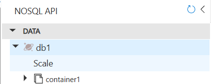  
      - Manual or Automaticを選択し、スループット(RU/s)を入力し、"Save"  
        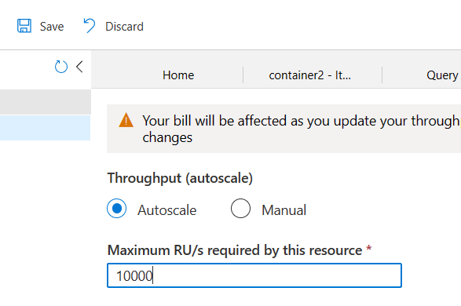
 
   - インデックスポリシーの変更
      - データエクスプローラーの**コンテナーの下**にある"Settings"を選択  
        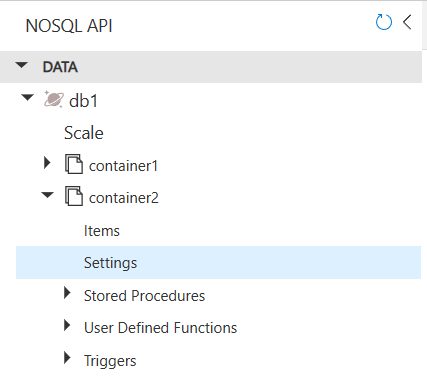  
      - 右ペインのタグ"Index Policy"を開く  
        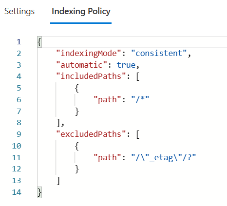

   - インデックスポリシーの内容を追記・変更して"Save"することで反映される。  
     インデックスの変更は使われていないRU/sを消費してバックグラウンドに実行される。

   ```JSON
   {
       "indexingMode": "consistent", ← "consistent" or "none"
       "automatic": true,  ← 自動で作成するか
       "includedPaths": [   ← インデックスを生成する項目・パス
           {
               "path": "/*"   ←「ルートからすべての項目」の意味
           }
       ],
       "excludedPaths": [   ← インデックスを生成しない項目・パス
           {
               "path": "/\"_etag\"/?"  ←"/etag"にはインデックスを作らない。\はエスケープ
           }
       ]
   }
   ```
